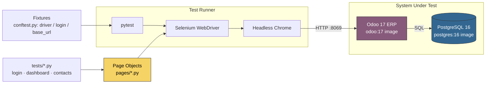

# Odoo Selenium E2E

[](README-pt-BR.md) [](README.md)

[](https://github.com/jessicasalestech/odoo-selenium-e2e/actions/workflows/ci.yml)
[](https://www.python.org/)
[](https://www.selenium.dev/)
[](https://www.odoo.com/)

Uma suíte **profissional de automação de testes** com **Selenium (WebDriver) + Python + pytest + Page Object Model (POM)**
que dirige o **ERP de código aberto Odoo (v17)** rodando em Docker — demonstrando testes reais de UI de ERP:
login/autenticação, navegação no dashboard do aplicativo e um fluxo completo de **CRUD de Contatos**
criar → pesquisar → editar → excluir.

Este é um projeto de QA de qualidade de portfólio por **Jessica Sales** (todo o código e a documentação original estão em inglês).

---

## 🏗 Arquitetura



* **`pages/`** — Page Objects (`LoginPage`, `DashboardPage`, `ContactsPage`) com localizadores explícitos
  e helpers semânticos; todos extendem `BasePage` (esperas explícitas do WebDriver, métodos legíveis).
* **`tests/`** — especificações pytest (`test_login.py`, `test_dashboard.py`, `test_contacts.py`, além
  de verificações de consistência `unit/` sem navegador que rodam sem Docker).
* **`conftest.py`** — fixtures modulares: um `driver` Chrome headless, uma fixture `login` que
  autentica **uma vez por módulo de teste** e um hook de falha que captura a tela + o DOM.
* **`.github/workflows/ci.yml`** — provisiona Odoo + Postgres via Docker Compose e executa a
  suíte de forma headless em todo push/PR para `main`.

---

## 🐳 Como o ERP é provisionado

O `docker-compose.yml` inicia dois contêineres **totalmente locais, de código aberto e descartáveis**:

| Service | Image     | Purpose                                     |
|---------|-----------|---------------------------------------------|
| `db`    | `postgres:16` | Backend PostgreSQL com healthcheck    |
| `web`   | `odoo:17` | O cliente web do ERP Odoo em `:8069`          |

O serviço web executa
`odoo -d odoo -i base,contacts,sale,purchase --without-demo=0`, que **inicializa um banco de dados TESTE**
com os módulos listados e **dados de demonstração**. No primeiro boot isso leva alguns minutos; um healthcheck
de prontidão consulta `http://localhost:8069/web/login` até retornar HTTP 200.

### Iniciar a stack

```bash
docker compose up -d --build
# aguarde o healthcheck / consulta:
until curl -fsS http://localhost:8069/web/login >/dev/null; do sleep 5; done
docker compose ps            # ambos devem estar "healthy"
```

### Credenciais de teste (APENAS PARA TESTE LOCAL)

O Odoo semeia seu **super administrador** padrão durante a inicialização do banco de dados:

| Field    | Value   |
|----------|---------|
| Login    | `admin` |
| Password | `admin` |

> ⚠️ Estas são credenciais **apenas de TESTE** para um banco de dados local descartável criado pelo arquivo
> Compose deste repositório. Elas serão removidas quando você executar `docker compose down -v`. Nunca as use contra
> uma instância real ou compartilhada do Odoo.

---

## 🧪 Executar os testes

### Pré-requisitos (local)

* Python 3.10+ (3.11 recomendado)
* Docker com o plugin **Docker Compose** (`docker compose`)
* Uma conexão com a internet (o primeiro run baixa um driver via `webdriver-manager`)

### Executar — E2E completo

```bash
# 1. Suba o ERP
docker compose up -d
until curl -fsS http://localhost:8069/web/login >/dev/null; do sleep 5; done

# 2. Virtualenv + dependências
python -m venv .venv
source .venv/Scripts/activate        # git-bash / Windows
pip install -r requirements.txt

# 3. Aponte para o ERP e execute
export BASE_URL=http://localhost:8069
pytest -v
```

### Executar — verificações de coerência sem navegador (sem Docker)

Os testes `unit/` validam a camada de Page Object (localizadores, exports, padrões) e podem rodar em qualquer
máquina sem navegador ou Odoo:

```bash
pytest -m unit -v
```

---

## ⚙ Configuração

Tudo é configurável via variáveis de ambiente (veja `.env.example`):

| Variable        | Default             | Description                          |
|-----------------|---------------------|--------------------------------------|
| `BASE_URL`      | `http://localhost:8069` | Endpoint web do Odoo (o CI faz override) |
| `ODOO_USER`     | `admin`             | Login para o usuário admin de TESTE   |
| `ODOO_PASSWORD` | `admin`             | Senha para o usuário admin de TESTE   |
| `CHROME_BINARY` | *(auto)*            | Caminho opcional para um Chrome custom |

O GitHub Actions lê estas de `.env` (copiado de `.env.example`) e define `BASE_URL` explicitamente.

---

## 🗂 Estrutura do projeto

```
.
├── .github/workflows/ci.yml   # CI: provisionamento Docker Compose + execução headless
├── pages/                     # Page Object Model
│   ├── base.py                # BasePage: waits, navegação, helpers
│   ├── login_page.py          # Formulário de login do Odoo (/web/login)
│   ├── dashboard_page.py      # Dashboard de apps + navegação superior
│   └── contacts_page.py       # Visualizações de lista/formulário de Contatos (CRUD)
├── tests/                     # Especificações pytest
│   ├── test_login.py          # fluxos de credenciais válidas / inválidas / em branco
│   ├── test_dashboard.py      # tiles de app, switcher, navegação
│   ├── test_contacts.py       # criar · pesquisar · editar · excluir
│   └── unit/test_pattern.py   # verificações de coerência do POM sem navegador
├── conftest.py                # fixtures driver / login / base_url + screenshots
├── docker-compose.yml         # Odoo 17 + Postgres 16 (banco de dados TESTE)
├── requirements.txt           # selenium, pytest, webdriver-manager
├── pyproject.toml             # configuração do pytest
└── .env.example               # ambiente de exemplo
```

---

## ✅ Mapa de cobertura de testes

| Area        | Test                                      | Key assertions                          |
|-------------|-------------------------------------------|-----------------------------------------|
| Login       | login válido chega ao dashboard           | chrome do dashboard + menu autenticado  |
| Login       | credenciais inválidas / em branco rejeitadas | alerta de erro de credencial visível |
| Dashboard   | tiles de aplicativos renderizam           | `>= 4` apps instalados (dados demo)     |
| Dashboard   | switcher de apps presente                 | switcher `o_menu_brand` superior visível |
| Dashboard   | navegar até Contatos pelos apps           | visualização de lista de Contatos carrega |
| Contacts    | criar um contato                          | novo registro pesquisável após salvar   |
| Contacts    | pesquisar um contato criado               | linha(s) retornada(s) contêm o registro |
| Contacts    | editar o nome de um contato               | valor renomeado persistido              |
| Contacts    | excluir um contato criado                 | registro não resolve mais para uma linha |
| Unit        | coerência da camada Page Object (sem Docker) | localizadores / exports / padrões válidos |

---

## ⚠️ Escopo e ressalvas

* **Os testes E2E exigem um Odoo em execução.** Localmente isso é Docker; no GitHub Actions o job de CI o
  provisiona. A suíte é validada ponta a ponta **no CI**, que é a execução canônica.
* Os seletores visam o cliente web do Odoo **17**; uma grande versão futura do Odoo pode exigir atualizações de localizadores.
* O fluxo de exclusão depende do viewer de lista do Odoo; os assertions são intencionalmente conservadores para
  permanecerem verdes entre temas de UI.

---

## 🔒 Segurança

Não existem segredos reais neste repositório. `admin`/`admin` são credenciais documentadas **apenas para TESTE**
para o banco de dados local descartável criado pelo arquivo Compose deste repositório. No CI, o workflow as define
via variáveis de ambiente com a mesma semântica de **TESTE**.

---

<p align="center"><small>Built by <b>Jessica Sales</b> · QA / Software Engineer · Selenium · pytest · POM · ERP · Odoo</small></p>