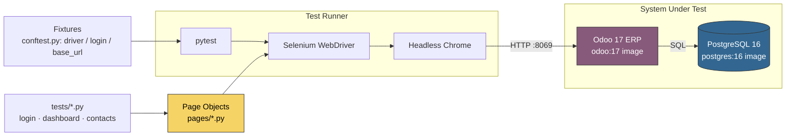

# Odoo Selenium E2E

[](https://github.com/jessicasalestech/odoo-selenium-e2e/actions/workflows/ci.yml)
[](https://www.python.org/)
[](https://www.selenium.dev/)
[](https://www.odoo.com/)

A professional **Selenium (WebDriver) + Python + pytest + Page Object Model (POM)** test-automation
suite that drives the **open-source Odoo ERP (v17)** running in Docker — demonstrating real ERP
UI testing: login/authentication, application dashboard navigation, and a full **Contacts CRUD**
create → search → edit → delete flow.

This is a portfolio-quality QA project by **Jessica Sales** (all code and docs in English).

---

## 🏗 Architecture



* **`pages/`** — Page Objects (`LoginPage`, `DashboardPage`, `ContactsPage`) with explicit locators
  and semantic helpers; all extend `BasePage` (explicit WebDriver waits, readable methods).
* **`tests/`** — pytest specs (`test_login.py`, `test_dashboard.py`, `test_contacts.py`, plus
  browserless `unit/` consistency checks that run without Docker).
* **`conftest.py`** — modular fixtures: a headless-Chrome `driver`, a `login` fixture that
  authenticates **once per test module**, and a failure hook that snapshots the screen + DOM.
* **`.github/workflows/ci.yml`** — provisions Odoo + Postgres via Docker Compose and runs the
  suite headless on every push/PR to `main`.

---

## 🐳 How the ERP is provisioned

`docker-compose.yml` starts two containers **fully local, open-source, disposable**:

| Service | Image     | Purpose                                     |
|---------|-----------|---------------------------------------------|
| `db`    | `postgres:16` | PostgreSQL backend with a healthcheck    |
| `web`   | `odoo:17` | The Odoo ERP web client on `:8069`          |

The web service runs
`odoo -d odoo -i base,contacts,sale,purchase --without-demo=0`, which **initialises a TEST database**
with the listed modules and **demo data**. On first boot this takes a few minutes; a readiness
healthcheck polls `http://localhost:8069/web/login` until it returns HTTP 200.

### Start the stack

```bash
docker compose up -d --build
# wait for the healthcheck / poll:
until curl -fsS http://localhost:8069/web/login >/dev/null; do sleep 5; done
docker compose ps            # both should be "healthy"
```

### Test credentials (LOCAL TEST ONLY)

Odoo seeds its default **super administrator** during database initialisation:

| Field    | Value   |
|----------|---------|
| Login    | `admin` |
| Password | `admin` |

> ⚠️ These are **TEST-only credentials** for a throwaway local database created by this repo's
> Compose file. They will be removed whenever you `docker compose down -v`. Never use them against
> a real or shared Odoo instance.

---

## 🧪 Run the tests

### Pre-requisites (local)

* Python 3.10+ (3.11 recommended)
* Docker with the **Docker Compose plugin** (`docker compose`)
* An internet connection (first run downloads a driver via `webdriver-manager`)

### Run — full E2E

```bash
# 1. Bring up the ERP
docker compose up -d
until curl -fsS http://localhost:8069/web/login >/dev/null; do sleep 5; done

# 2. Virtualenv + deps
python -m venv .venv
source .venv/Scripts/activate        # git-bash / Windows
pip install -r requirements.txt

# 3. Point at the ERP and run
export BASE_URL=http://localhost:8069
pytest -v
```

### Run — browserless coherence checks (no Docker)

The `unit/` tests validate the Page Object layer (locators, exports, defaults) and can run on any
machine without a browser or Odoo:

```bash
pytest -m unit -v
```

---

## ⚙ Configuration

Everything is configurable via environment variables (see `.env.example`):

| Variable        | Default             | Description                          |
|-----------------|---------------------|--------------------------------------|
| `BASE_URL`      | `http://localhost:8069` | Odoo web endpoint (CI overrides) |
| `ODOO_USER`     | `admin`             | Login for the TEST admin user        |
| `ODOO_PASSWORD` | `admin`             | Password for the TEST admin user     |
| `CHROME_BINARY` | *(auto)*            | Optional path to a custom Chrome     |

GitHub Actions reads these from `.env` (copied from `.env.example`) and sets `BASE_URL` explicitly.

---

## 🗂 Project layout

```
.
├── .github/workflows/ci.yml   # CI: Docker Compose provision + headless run
├── pages/                     # Page Object Model
│   ├── base.py                # BasePage: waits, navigation, helpers
│   ├── login_page.py          # Odoo login form (/web/login)
│   ├── dashboard_page.py      # Apps dashboard + top navigation
│   └── contacts_page.py       # Contacts list/form views (CRUD)
├── tests/                     # pytest specs
│   ├── test_login.py          # valid / invalid / blank credential flows
│   ├── test_dashboard.py      # app tiles, switcher, navigation
│   ├── test_contacts.py       # create · search · edit · delete
│   └── unit/test_pattern.py   # browserless POM coherence checks
├── conftest.py                # driver / login / base_url fixtures + screenshots
├── docker-compose.yml         # Odoo 17 + Postgres 16 (TEST database)
├── requirements.txt           # selenium, pytest, webdriver-manager
├── pyproject.toml             # pytest configuration
└── .env.example               # sample environment
```

---

## ✅ Test coverage map

| Area        | Test                                      | Key assertions                          |
|-------------|-------------------------------------------|-----------------------------------------|
| Login       | valid login reaches dashboard             | dashboard chrome + authenticated menu   |
| Login       | invalid / blank credentials rejected      | visible credential error alert          |
| Dashboard   | application tiles render                  | `>= 4` installed apps (demo data)       |
| Dashboard   | apps switcher present                     | top `o_menu_brand` switcher visible     |
| Dashboard   | navigate to Contacts via apps             | Contacts list view loads                |
| Contacts    | create a contact                          | new record searchable after save        |
| Contacts    | search a created contact                  | returned row(s) contain the record      |
| Contacts    | edit a contact name                       | renamed value persisted                 |
| Contacts    | delete a created contact                  | record no longer resolves to a row      |
| Unit        | Page Object layer coherence (no Docker)   | locators / exports / defaults valid     |

---

## ⚠️ Scope & caveats

* **E2E tests require a running Odoo.** Locally this is Docker; on GitHub Actions the CI job
  provisions it. The suite is validated end-to-end **in CI**, which is the canonical run.
* Selectors target Odoo **17**'s web client; a major future Odoo release may need locator updates.
* The delete flow depends on Odoo's list viewer; assertions are intentionally conservative to stay
  green across UI themes.

---

## 🔒 Security

No real secrets exist in this repository. `admin`/`admin` are documented **TEST-only** credentials
for the disposable local database created by this repo's Compose file. In CI the workflow sets them
via env variables with the same **TEST** semantics.

---

<p align="center"><small>Built by <b>Jessica Sales</b> · QA / Software Engineer · Selenium · pytest · POM · ERP · Odoo</small></p>